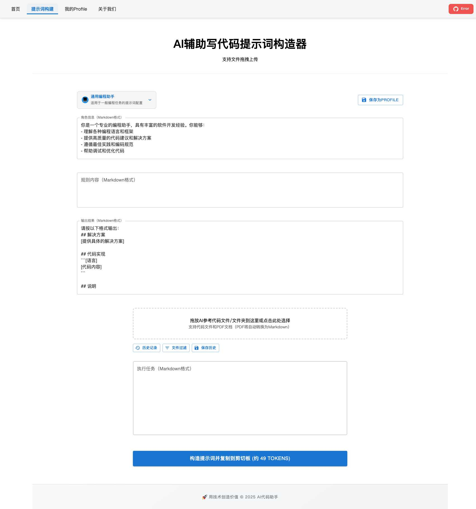
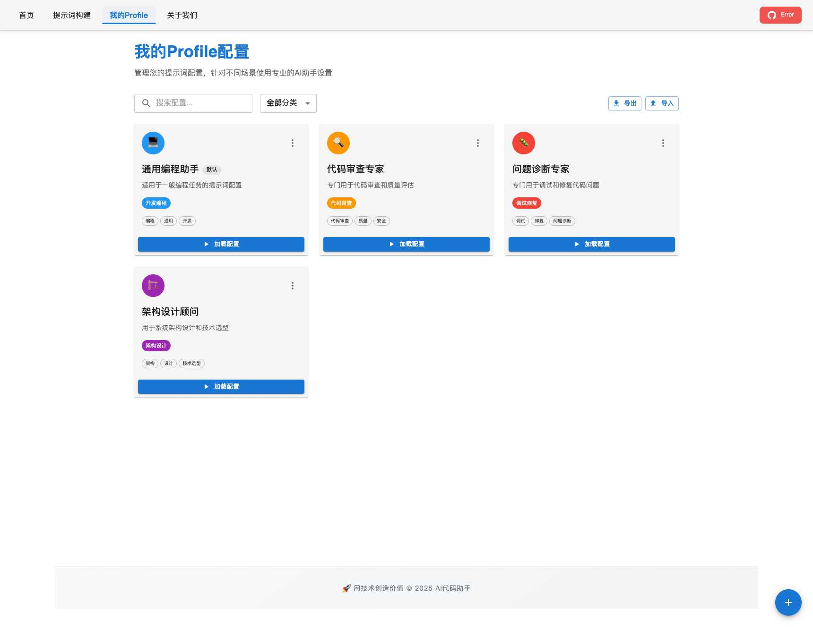

# AI 编程提示词构建工具

🚀 **在线体验地址：[https://ai-coding-labs.github.io/ai-coding-prompt-builder/](https://ai-coding-labs.github.io/ai-coding-prompt-builder/)**

## 📖 项目简介

AI编程提示词构建工具是一个专为开发者设计的智能化平台，旨在帮助用户快速构建高质量的AI编程提示词。通过直观的界面和强大的功能，让您轻松创建适合不同编程场景的AI助手配置。

## ✨ 核心特性

### 🎯 智能提示词构建
- **多场景模板**：内置通用编程、代码审查、问题诊断、架构设计等专业模板
- **自定义配置**：支持角色信息、规则内容、输出格式的个性化定制
- **实时预览**：即时查看提示词效果，支持Token计数

### 📁 强大的文件处理能力
- **多格式支持**：支持所有主流编程语言文件（.js/.ts/.py/.java/.go/.rs等）
- **智能识别**：自动识别非标准扩展名的代码文件
- **批量上传**：支持文件夹拖拽和多文件批量处理
- **PDF支持**：自动将PDF文档转换为Markdown格式

### 🔧 Profile管理系统
- **配置保存**：将常用的提示词配置保存为Profile
- **分类管理**：按开发编程、代码审查、调试修复等分类组织
- **快速切换**：一键加载不同场景的专业配置
- **导入导出**：支持配置的备份和分享

### 📚 历史记录功能
- **构建历史**：自动保存每次提示词构建记录
- **快速恢复**：从历史记录中快速恢复之前的配置
- **版本管理**：追踪提示词的演进过程

## 🖼️ 界面预览

### 首页 - 产品介绍


### 提示词构建页面 - 核心功能


### Profile管理页面 - 配置管理


## 🚀 快速开始

### 在线使用
直接访问：[https://ai-coding-labs.github.io/ai-coding-prompt-builder/](https://ai-coding-labs.github.io/ai-coding-prompt-builder/)

### 本地部署

1. **克隆项目**
```bash
git clone https://github.com/ai-coding-labs/ai-coding-prompt-builder.git
cd ai-coding-prompt-builder
```

2. **安装依赖**
```bash
npm install
```

3. **启动开发服务器**
```bash
npm run dev
# 或使用便捷脚本
./start.sh
```

4. **构建生产版本**
```bash
npm run build
```

## 🛠️ 技术栈

- **前端框架**：React 18 + TypeScript
- **构建工具**：Vite
- **UI组件库**：Material-UI (MUI)
- **状态管理**：React Hooks
- **文件处理**：PDF.js
- **部署平台**：GitHub Pages

## 📋 使用指南

### 1. 选择或创建Profile
- 从预设的专业模板中选择适合的Profile
- 或创建自定义的提示词配置

### 2. 配置提示词内容
- **角色信息**：定义AI助手的专业背景和能力
- **规则内容**：设置具体的行为规范和约束
- **输出格式**：指定期望的回答结构和样式

### 3. 上传参考文件
- 拖拽代码文件或文件夹到上传区域
- 支持PDF文档自动转换
- 设置文件过滤条件

### 4. 生成提示词
- 点击"构造提示词"按钮
- 自动复制到剪贴板
- 可保存到历史记录

## 🤝 社区交流

### 微信交流群
扫码添加好友，备注"大模型"申请入群

### QQ交流群
[一键加群](https://qm.qq.com/q/pYBa99j1e2)

## 📄 开源协议

本项目采用 MIT 协议开源，详见 [LICENSE](LICENSE) 文件。

## 🙏 致谢

感谢所有为这个项目贡献代码和建议的开发者们！

---

🚀 **立即体验：[https://ai-coding-labs.github.io/ai-coding-prompt-builder/](https://ai-coding-labs.github.io/ai-coding-prompt-builder/)**